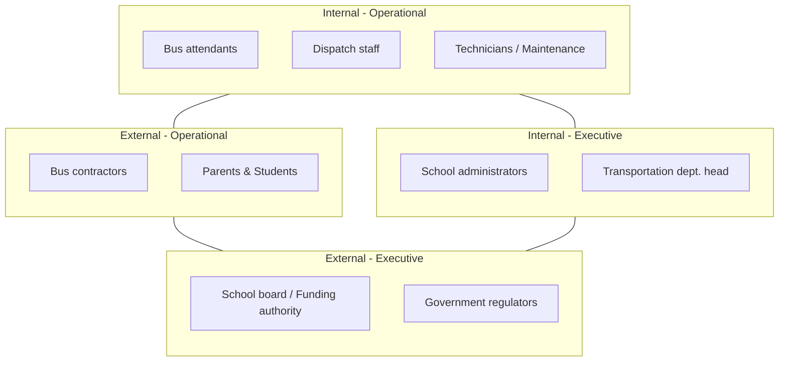

```mermaid
flowchart TB
    subgraph Internal_Operational ["Internal - Operational"]
        direction TB
        A["Bus attendants"]
        B["Dispatch staff"]
        C["Technicians / Maintenance"]
    end

    subgraph Internal_Executive ["Internal - Executive"]
        direction TB
        D["School administrators"]
        E["Transportation dept. head"]
    end

    subgraph External_Operational ["External - Operational"]
        direction TB
        F["Bus contractors"]
        G["Parents & Students"]
    end

    subgraph External_Executive ["External - Executive"]
        direction TB
        H["School board / Funding authority"]
        I["Government regulators"]
    end

    Internal_Operational --- Internal_Executive
    External_Operational --- External_Executive
    Internal_Operational --- External_Operational
    Internal_Executive --- External_Executive
```